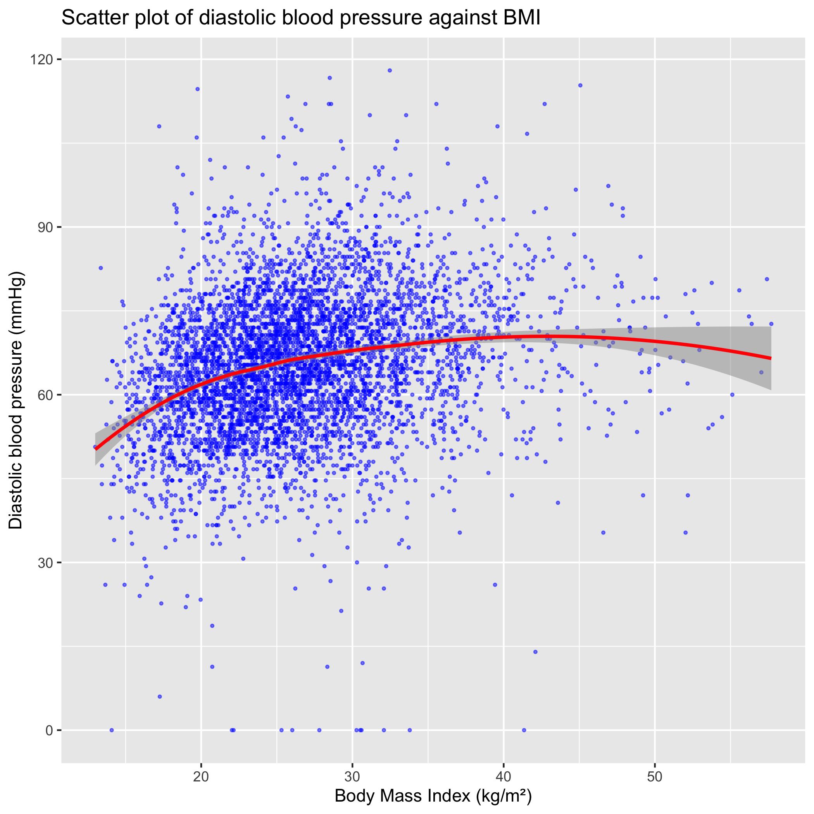
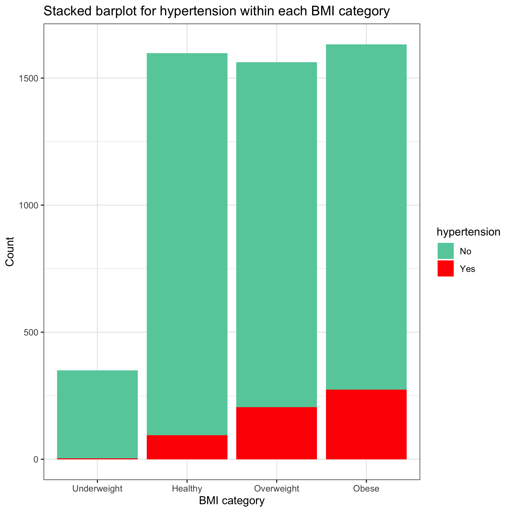

```{r setup, include=FALSE}
knitr::opts_chunk$set(echo = TRUE)
```


## Data cleaning


I uesd Body Measures (BMX_D) and Blood Pressure (BPX_D). 

I kept only the variables I considered necessary. I chose to use the first three readings for SBP and DBP since they all had over 6000 recorded observations, whereas the fourth reading had less than 2000. 

I merged the two data sets. 

One quarter of the participants had at least one missing value. I chose to drop them, but this may cause bias. 

I checked for extreme values. Bodyweights of 20 kg and 201 kg, heights of 118 cm and 204 cm and BMI values of 13 and 57 are plausible (1)(2). SBP of 74 mmHg and 234 mmHg are medical emergencies, but possible (3)(4). DBP readings of 0 and 120 are possible (5)(6). 

I created variables for the averages of the three SBP and three DBP measurements. Also, since BMI and blood pressure have clinically important thresholds (5), I created a BMI categorical variable and a hypertension variable. 

I used lintr and styler to check styling and style my code. 


## Data exploration


I created a Shiny application called histograms_app.R, located in the 'code' directory. It creates a histogram of whichever variable you select. You can also view the data set below this. Note, this code is heavily inspired by the code we wrote in the practical in week 10. 

Observe, weight appears normally distributed around 80 kg, height around 170cm and BMI around 25. The three SBP readings, and therefore their average, all have a similar positively skewed distribution, centered around 115 mmHg. The three DBP readings, and therefore their average, all have a similar normal distribution, centered around 65 mmHg. There is a noticeable group of outliers at zero, perhaps indicating that those measurements do not reflect reality. 


## Data visualisations


I wanted to visualise the relationship between BMI and blood pressure in multiple ways. I wanted to make use of the continuous and categorical measures of BMI, and I wanted to use SBP, DBP and the binary hypertension variable. Also, I wanted to visualise the relationship between weight, height and BMI. 


***


{#id .class width=70% height=70%}


This plot allows us to see the relationship between weight and height, as well as the distribution of weight and height for each BMI category, simultaneously. I colour-coded BMI with a palette that conveys how healthy each category is. 

There is a positive correlation between weight and height. There is heterogeneity of variance; the spread of height increases as weight increases (or vice versa). Looking at the marginal density plots of height, we can see the healthy, overweight and obese participants have a similar distribution of height, but the underweight participants are shorter overall, with a wider spread. There is possibly a clinical explanation, such as malnutrition stunting growth. 


***


{#id .class width=70% height=70%}


I used small points with transparency so you can see how dense the data is where it is clustered. I used a loess regression line because the relationship does not appear linear. SBP increases as BMI increases. This relationship is less clear for higher BMI values, but this may be due to the scarcity of observations there. 


***


{#id .class width=70% height=70%}


SBP increases as BMI increases. This relationship appears to reverse for very high BMI values, but this may be a weakness of loess regression over fitting when there are few values. 


***


{#id .class width=70% height=70%}


I used violin plots to give a detailed depiction of the distributions of each group. Colours were chosen to convey healthy and unhealthy. A simple background was used to aid expressiveness.  

The median BMI, and the densest part of the distribution, are higher for those with hypertension than those without. There is also a higher density of very high BMI values amoung those with hypertension. 


***


{#id .class width=70% height=70%}


The median SBP, and the densest part of the distribution, increase as you ascend the BMI categories. The distributions become wider spread, and slightly less skewed, as you ascend the BMI categories, so very high SBP values become more common. 


***


{#id .class width=70% height=70%}


I used a stacked barplot to more effectively convey the change in proportion of hypertension between the BMI categories. I put those with hypertension at the bottom because it makes them easier to compare. 

The proportion of participants with hypertension increases as we ascend the BMI categories. 


***


## References

1. https://www.livestrong.com/article/434699-what-is-a-dangerously-low-bmi/
2. https://en.wikipedia.org/wiki/List_of_heaviest_people
3. https://www.28beaumontstreet.co.uk/bp-calculator
4. https://www.kidney.org.uk/high-blood-pressure#:~:text=This%20is%20a%20rare%20form,vision%2C%20headaches%20and%20abdominal%20pain.
5. https://www.heart.org/en/health-topics/high-blood-pressure/understanding-blood-pressure-readings
6. https://www.theiaforum.org/article.asp?issn=2589-7934;year=2016;volume=17;issue=1;spage=32;epage=33;aulast=Choudhary#:~:text=Extremely%20low%20or%20zero%20DBP,arteriovenous%20malformation%2C%20and%20aortic%20dissection.
